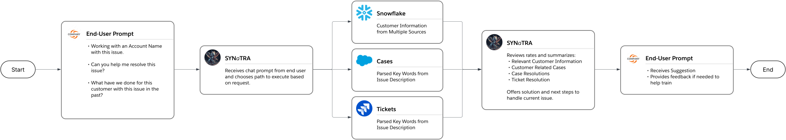

# SYNaTRA: Synthetic Triage Assistant for Customer Success

An AI-powered triage and context engine that accelerates case resolution and empowers Customer Success teams with actionable insight.

---

## Overview

SYNaTRA (Synthetic Triage Assistant) is an intelligent automation framework designed to assist Customer Success Managers (CSMs) in understanding customer context faster and resolving tickets more effectively.

By orchestrating data across Salesforce, Jira, and Snowflake, SYNaTRA retrieves, summarizes, and correlates relevant cases, tickets, and subscription details. This reduces time-to-context and improves first-contact resolution.

---

## Business Problem

Customer Success and Support teams often struggle with:
- Fragmented data across multiple platforms (Salesforce, Jira, Snowflake)
- Long time-to-context when reviewing customer history
- Inconsistent triage quality across agents
- Limited visibility into historical resolution paths

These challenges lead to slower response times, variable customer experiences, and higher operational costs.

---

## Solution: SYNaTRA AI Agent

SYNaTRA acts as a virtual teammate that:

1. Retrieves and summarizes all historical cases, tickets, and subscriptions linked to a customer.
2. Identifies the most relevant prior resolutions and technical notes.
3. Suggests potential resolution paths or next steps based on historical patterns.
4. Customer Profile (Phase 1 sanity check): Establishes a verified baseline of customer data within Salesforce before orchestration begins. This ensures all triage logic and data retrieval are tested against a consistent, validated profile.
5. (Planned Phase 2) Provides customer-tailored resolutions using contextual LLM prompts.
6. (Future Phase 3) Powers virtual onboarding using the common issues and scenarios from the previous phases data.
7. (Future Phase 4) real-time in-call coaching for CSMs.

---

## Architecture Overview

Core Components:
- Salesforce (Apex + Visualforce)
  - Custom Customer Profile extension controller used as a Phase 1 sanity check to validate account and subscription data integrity of Agent.
  - SOQL queries for active subscriptions, current cases, past 20 cases and account metadata.

- [Workato Automation Layer](/workato/WorkatoWorkFlowOverview.md)
  - Orchestrates cross-system data retrieval.
  - Executes SOQL, JQL, and SQL queries to aggregate insights.
  - Normalizes data for AI summarization.

- Jira Integration
  - JQL filters to identify related engineering and data ops tickets and prior resolutions.

- Snowflake Analytics
  - Consolidated customer information. 
  - SQL aggregation layer for trend detection and case metrics.

- AI Summarization Module
  - Generates customer-centric summaries and recommended resolution steps.

---

## Technical Stack

| Layer | Technology | Purpose |
|-------|-------------|----------|
| CRM / Data Source | Salesforce (Apex, VF, SOQL) | Profile creation, case history |
| Workflow Orchestration | Workato | Cross-system automation and trigger logic |
| Issue Tracking | Jira (JQL) | Engineering ticket retrieval |
| Data Warehouse | Snowflake (SQL) | Customer metrics and historical analytics |
| AI Layer | OpenAI API / LLM (planned) | Summarization and recommendation engine |

---

## Example Workflow

1. Trigger: CSM enters customer identifier and/or issue description.
2. Retrieval: Workato orchestrates SOQL (Salesforce), JQL (Jira), and SQL (Snowflake) queries.
3. Aggregation: Data is unified into a structured summary payload.
4. Synthesis: The AI agent produces a concise narrative of customer history, key pain points, and next-best-actions.
5. Delivery: CSM receives a ready-to-use context brief directly in the Salesforce console.

---

## Outcomes (MVP Metrics)

| Metric | Baseline | SYNaTRA Impact |
|--------|-----------|----------------|
| Time-to-Context | ~15 minutes | 2-3 minutes |
| First-Contact Resolution (FCR) | 68% | 82% (projected) |
| New CSM Ramp Time | 8 weeks | 4–5 weeks |
| Customer CSAT | baseline +10% (target) |  |

Metrics are directional estimates based on internal pilot performance.

---

## Design Principles

- Data-driven context: Every recommendation is grounded in historical patterns.  
- System-agnostic: Built to extend beyond Salesforce and Jira as connectors evolve.  
- Privacy-first: All datasets and identifiers are masked or synthetic in this repository.  
- Explainable automation: Transparent flow from retrieval to summarization to suggestion.  

---

